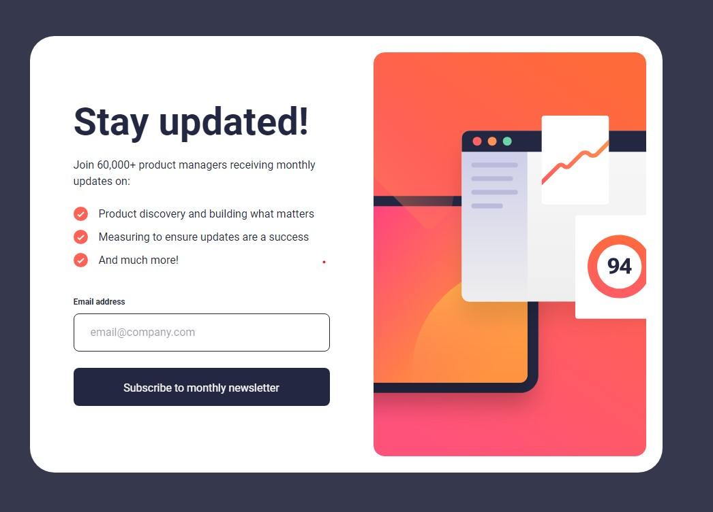
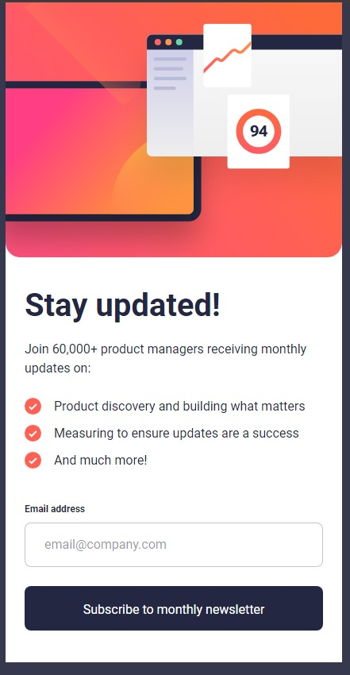

# Frontend Mentor - Newsletter sign-up form with success message solution

This is a solution to the [Newsletter sign-up form with success message challenge on Frontend Mentor](https://www.frontendmentor.io/challenges/newsletter-signup-form-with-success-message-3FC1AZbNrv).

## Table of contents

- [Overview](#overview)
  - [Screenshot](#screenshot)
  - [Links](#links)
- [My process](#my-process)
  - [Built with](#built-with)
  - [Continued development](#continued-development)
- [Author](#author)

## Overview

### Screenshot

### Links

- Solution URL: [https://github.com/Roman-oryol/newsletter-sign-up](https://github.com/Roman-oryol/newsletter-sign-up)
- Live Site URL: [https://ro-newsletter-sign-up.netlify.app/](https://ro-newsletter-sign-up.netlify.app/)

## My process

### Built with

- Semantic HTML5 markup
- CSS custom properties
- CSS Grid
- CSS Flex
- Mobile-first workflow
- JavaScript

### Continued development

React and JS development

## Author

- Frontend Mentor - [Roman-oryol](https://www.frontendmentor.io/profile/Roman-oryol)
